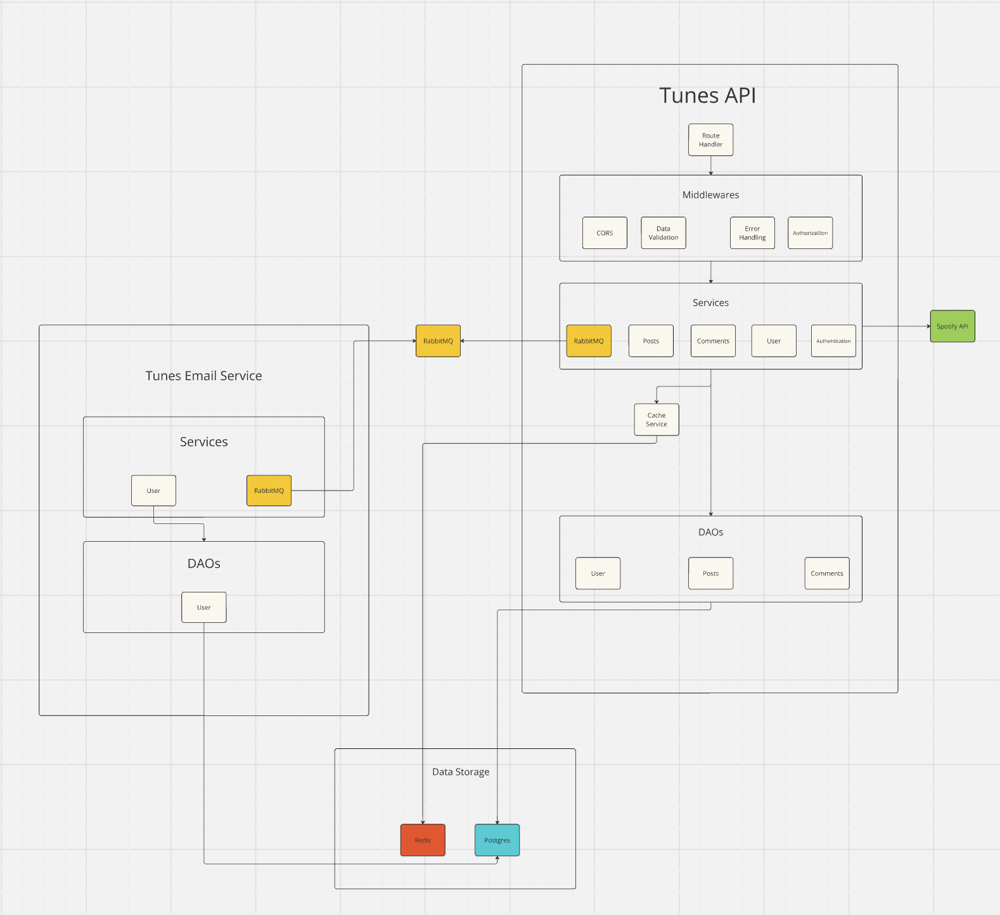

# REST HTTP API for Tunes Webapp

## About

This project is the entire backend for the Tunes webapp. Tunes is a music sharing social media, where 
users can post songs that they have recently listened to, and provide a rating and review. 
Inspired by [letterbox](https://letterboxd.com/)

## Usage

* Copy .env.example to .env file 
```
cp .env.example .env
```
* Fill out respective environment variables for the application

* Start All Dependencies (Postgres and Redis)
```
Make docker-start
```
* Run database migrations
```
Make goose-up
```
* Start backend API
```
Make api-start
```

* PgAdmin is located at http(s)://${your_host}:4000 
* RedisUI is located at http(s)://${your_host}:8001

## Backend Architecture


## Backend code structure



## Environment Variable File

Within the project there exists a .env.example file. This serves as an example for users to populate their own. Simply cp .env.example .env and populate this file with the required environment variables
to get started

## Makefile

A makefile is used to easily start the application, run the docker containers, and run database migrations. All of the relevant commands can be found in ~/Makefile 
The makefile includes the .env file described above, so database migration and application integration are seamless

## Spotify Integration

Tunes is directly integrated with spotify. In order to use the application, you will need a spotify premium account to log in with. All song, album, and artist information is pulled from the spotify [webAPI](https://developer.spotify.com/documentation/web-api)

## Hand-rolled Authentication and Authorization/User Sessions via JWT

* Authentication steps: 
    * Integrate with spotify authorization code flow to retreieve a spotify API key via authorization code flow
    * Wrap spotify API key along along with some extra user information in a JWT, and return this to the user in a cookie
    * Upsert user into database with default role of "BASIC" 
    * Return a refresh JWT in a http only cookie

* Authorization
    * When users reach out to the Tunes API, they must attach the access JWT in their Authorization header with the format "Bearer access_jwt"
    * User Authorization is handled via a middlewhere which checks the user role in the JWT

# CSRF Prevention and Double Submit Cookies

Authenication is implemented via the Authentication HTTP header, to mitigate CSRF attack vectors. The frontend application has to grab the JWT from the cookie and 
put it in the authorization header with each request. This is safe, because other websites cannot read the cookies set for the Tunes frontend, meaning if they attempt
a CSRF attack, the Authorization header will be empty (or falsely populated) and the Tunes backend will return either a 403 Forbidden or 401 Unauthorized. This JWT is short lived
and therefore the frontend will need to utilize the refresh JWT in order to keep the access JWT up to date

# Refreshing JWT

In order to refresh the access JWT provided by the tunes backend, the frontend simply hits the refresh JWT endpoint. The frontend needs to set the Authorization header with the expired 
access JWT in order for the request to be successful, to mitigate CSRF attacks. Refreshing is implemented to limit the time an attacker has access to the users account in the event that the 
user leaks their access token. It is also useful to have a short lived access token in the even that user credentials are updated, or a user account is deleted

## Database

This application uses a PostgresSQL database in order to store all data information. The data schema can be seen below

# Schema

here is the schema

## Caching

* Database entities that implement caching (WIP)
    * Users

* The caching strategy is a simple one. 
    * When a request comes in, services first check the cache. If it is empty, they will populate the cache with the entry retrieved from the database
    * When a resource is updated, the entry is first updated in the database. If an equivalent entry exists in the cache, it is removed

## Dockerization

In order to run this application with ease, docker and docker-compose has been used in order to centralize the dependencies. Postgres, PGAdmin, and Redis are all available to be run with
Docker, and utilize the .env variables to do so

## Goose

golang [goose](https://github.com/pressly/goose) is utilized to run database migrations. The database initially is completely empty. Within the migrations folder of the Tunes backend, there are database
migrations which will get the postgres database set up properly to integrate with the Tunes application


## Swagger

* Swagger: http(s)://${your_host}:${your_port}:/swagger/index.html
* Setting Authorization header
    * Go to http(s)://${your_host}:${your_port}/login and login
    * Grab ACCESS_JWT from cookies
    * Swagger authorize button -> "Bearer your_access_token"
