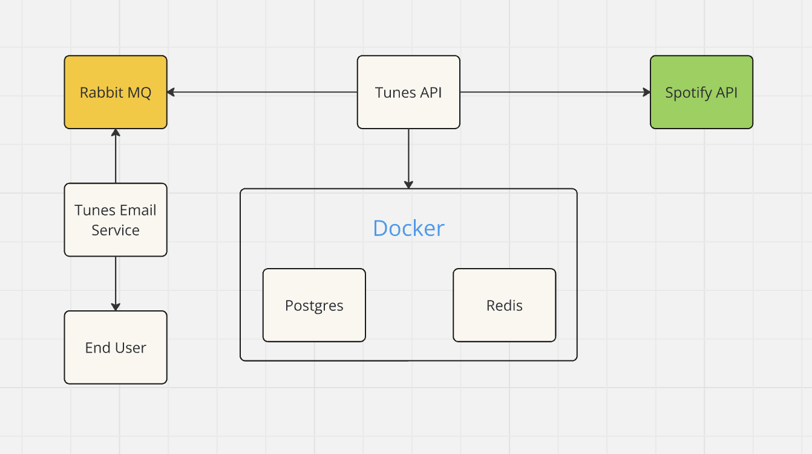

# REST HTTP API for Tunes Webapp

## About

This project is the entire backend for the Tunes webapp. Tunes is a music sharing social media, where 
users can post songs that they have recently listened to, and provide a rating and review. 
Inspired by [letterbox](https://letterboxd.com/)

## Usage

Copy .env.example to .env file 
```
cp .env.example .env
```
Fill out respective environment variables for the application

Start All Dependencies (Postgres and Redis)
```
Make docker-start
```
Run database migrations
```
Make goose-up
```
Start backend API
```
Make api-start
```

PgAdmin is located at http(s)://your_host:4000 \n
RedisUI is located at http(s)://your_host:8001

## Backend Architecture



## Backend code structure

### NOTE


## Spotify Integration

Tunes is directly integrated with spotify. In order to use the application, you will need a spotify premium account to log in with. All song, album, and artist information is pulled from the spotify [webAPI](https://developer.spotify.com/documentation/web-api)

## Hand-rolled Authentication and User Sessions via JWT

Authentication is performed with a little bit of help from the spotify webAPI. Users log in with their spotify account by visiting the login endpoint
provided by tunes. Tunes implements the spotify authorization code flow. Once users authenticate via spotify, their credentials are returned to the 
Tunes application. Users are then entered into the Tunes database. The information returned by the spotify authentication endpoint is wrapped 
in a Tunes-specific JWT, which adds some additional information which helps identify which permissions a user has on the website. It is signed with a 
secret key, and returned to the user via cookies along with a refresh JWT. The refresh JWT is set to be http-only, while the access JWT is not

## CSRF Prevention and Double Submit Cookies

Authenication is implemented via the Authentication HTTP header, to mitigate CSRF attack vectors. The frontend application has to grab the JWT from the cookie and 
put it in the authorization header with each request. This is safe, because other websites cannot read the cookies set for the Tunes frontend, meaning if they attempt
a CSRF attack, the Authorization header will be empty (or falsely populated) and the Tunes backend will return either a 403 Forbidden or 401 Unauthorized. This JWT is short lived
and therefore the frontend will need to utilize the refresh JWT in order to keep the access JWT up to date

## Refreshing JWT

In order to refresh the access JWT provided by the tunes backend, the frontend simply hits the refresh JWT endpoint. The frontend needs to set the Authorization header with the expired 
access JWT in order for the request to be successful, to mitigate CSRF attacks. Refreshing is implemented to limit the time an attacker has access to the users account in the event that the 
user leaks their access token. It is also useful to have a short lived access token in the even that user credentials are updated, or a user account is deleted

## Database

This application uses a PostgresSQL database in order to store all data information. The data schema can be seen below

# Schema

here is the schema

## Caching

Caching for this application is a WIP. Connection to a redis database is set up to work as is, and service endpoints need to implement business logic to handle caching DB responses

## Dockerization

In order to run this application with ease, docker and docker-compose has been used in order to centralize the dependencies. Postgres, PGAdmin, and Redis are all available to be run with
Docker, and utilize the .env variables to do so

## Goose

golang [goose](https://github.com/pressly/goose) is utilized to run database migrations. The database initially is completely empty. Within the migrations folder of the Tunes backend, there are database
migrations which will get the postgres database set up properly to integrate with the Tunes application

## Environment Variable File

Within the project there exists a .env.example file. This serves as an example for users to populate their own. Simply cp .env.example .env and populate this file with the required environment variables
to get started

## Makefile

A makefile is used to easily start the application, run the docker containers, and run database migrations. Simply run 

```
Make docker-start // starts up Postgres, Pgadmin, and Redis
Make goose-up // runs database migrations against Postgres defined at the environment variable location. In this case, docker
```

If you wish to run the application with local Postgres instance and Redis instance, than simply point the environment variables to their respective resources

```
Make goose-up // runs database migrations against Postgres defined at the environment variable location
```

## Swagger

In order to easily interface with the Tunes backend API, swagger has been implemented. Simply go to http(s)://HOST_NAME:PORT/swagger/index.html
This will load the swagger webpage where all of the endpoints are accessable. In order to start hitting endpoints, the Authorization header must be set
This can be done by navigating to http(s)://HOST_NAME:PORT/login and logging in with spotify credentials. Afterwards, checking the cookies in the browser
For the ACCESS_JWT cookie. Copy this cookie, and navigate back to the Swagger page. In the top right, there is a "Authorization" button. Click this button
and insert "Bearer your_copied_token" This will attach the access JWT along in the Authorization header with each request made via Swagger

# Application Design

Services, DAOs, interfaces for swapability
